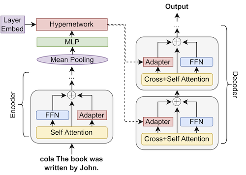

# Hyperdecoders

Instance-specific decoders for efficient multi-task adaptation of pretrained language models. By generating adapter parameters based off encoder representations, we are able to more effectively enhance the multi-tasking abilities of the model. [Check out our paper for details!](https://arxiv.org/abs/2203.08304) Here is an overview of our approach:



We evaluate on GLUE, MRQA, and a mixture of summarisation and NLI tasks. Our results training and evaluating on GLUE using T5 v1.1 + LM adapt are as follows:

| Model  | CoLA | SST2 | STS-B | MRPC | QQP | MNLI | QNLI | RTE | Avg |
| -----  | ---- | ----- | ----- | ---- | --- | ---- | ---- | --- | --- |
|Full Finetuning | **63.6** | 94.8 | 91.6/92.0 | 88.7/91.8 | **92.2/89.5** | 88.6 | 93.3 | 77.5 | 86.3 |
| Hyperformer | 19.2 | 87.3 | 86.2/85.8 | 73.4/81.3 | 87.0/82.8 | 77.7 | 84.2 | 55.1 | 71.5 |
| Single Adapter | 58.5 | 95.7 | 90.1/90.3 | **89.4/92.2** | 91.4/88.6 | 89.8 | 94.1 | 80.7 | 86.2 |
| **Hyperdecoder (ours)** | 58.7 | **95.9** | **91.8/92.0** | 89.2/92.0 | 91.1/88.3 | **90.0** | **94.2** | **80.8** | **86.5** |

Our approach only trains roughly 3% of the total parameters within the model.

[See our paper](https://arxiv.org/abs/2203.08304) for more! This codebase is built off the [hyperformer codebase](https://github.com/rabeehk/hyperformer), with the following major changes:
- Added several tasks and relevant preprocessing, including MRQA (with and without sliding windows), xsum, CNN/Daily Mail, Wiki Lingua, abductive NLI, and adversarial NLI.
- Fixed some minor bugs including the 'split validation test' not being applied to the training set.
- Added new adapter and parameter generation code in `hyperdecoder/modeling`, and removed the old adapter code. Added relevant training arguments for these setups (encoder/decoder adapter sizes, etc).
- Updated the trainer to save copies of generated answers along with likelihood scores for MRQA evaluation.

## Installation

Install pytorch (1.10 recommended). Install required packages, preferably in a virtualenv: `pip install -r requirements.txt`.

## Training

Navigate into the `hyperdecoder` directory, and then you can run any configuration with `python finetune_trainer.py configs/<config>`. Please note training only works for non-distributed setups - sorry!

For example, for GLUE, the Hyperdecoder model can be run with `python finetune_trainer.py configs/glue_ablations/glue_manual_generated.json`. The trained model will be placed in `hyperdecoder/output`, and the evaluation logs can be found in `hyperdecoder/output/log.txt`. You can control how often the model is evaluated and saved with `eval_steps` and `save_steps` in the config.

## Config

Some useful config items:
- `{de,en}coder_adapter`: controls how we adapt the encoder/decoder. Can be `none` (no adapters), `manual` (regular adapters), `generated` (generated adapters). Note `generated` in the encoder results in the encoder being run twice: once with adapters to produce an embedding that is then used to adapt the encoder for a second run (the output of which is passed to the decoder as usual).
- `freeze_model/unfreeze_{en,de}coder_adapters/unfreeze_{en,de}coder`: freeze/unfreeze the relevant parts of the model for training. This is accomplished through the `requires_grad` flag. Usually we freeze the whole model and then unfreeze the encoder/decoder adapter bits.
- `max_steps`: controls how many training steps. Note that `num_train_epochs` is ignored when this is set, we just train based on steps and do not distinguish any sort of epoch boundary.
- `{en,de}coder_adapter_dim`: controls the adapter bottleneck size. You can control separately for encoder/decoder.
- `hypernetwork_bottleneck`: controls the hypernetwork bottleneck size (see paper for details on this).
- `split_validation_test`: split the validation sets of datasets into validation and test splits, so we can early-stop based on validation metrics and then eval on the test split. This is what we do for most experiments in our paper.

Most other config options are hopefully either straightforward or do not need to be changed. Note that the hyperdecoder model is achieved by setting `encoder_adapter: manual, decoder_adapter: generated`.

The primary configs to use are:
- `glue_ablations/glue_manual_generated.json`: the main GLUE-trained hyperdecoder model from table 1.
- `mrqa_experiments/unbalanced_manual_generated.json`: the MRQA hyperdecoder model from tables 4/5.

There are many other config files from other runs that correspond either to other models in the paper or stuff we tried during the development of this work.

### MRQA Evaluation

Due to the sliding window nature of MRQA, evaluation is separately to running the model. When running evaluation with MRQA, the model will at the end output answer files for the validation and test sets as `<step_num>predicted_answers.json` and `<step_num>predicted_answers_test.json`. 

After getting these files, navigate into `mrqa_eval` and run the `construct_eval_folders.sh` script, which will download the MRQA evaluation data for you and place it in useful folders. You can then run evaluation on *in-domain* data as follows (note the in-domain data is treated as validation data and so predictions are output every evaluation phase):

`for file in in-domain/*.gz; do echo $file; python eval.py $file <predicted_answers.json file>; done`

The *out-domain* data can be evaluated similarly (note the out-domain predictions are only generated during test phases):

`for file in out-domain/*.gz; do echo $file; python eval.py $file <predicted_answers_test.json file>; done`

In both cases, you will get terminal output that prints (a) the name of the dataset being evaluated, and then (b) the performance on that particular dataset. Note our evaluation script is the same as the original MRQA evaluation script but with some extra code to handle picking the highest likelihood answer (as the model output saves these scores but does not filter on them). As such, it is fairly simple to convert our `predicted_answer.json` files to the format needed for the original MRQA evaluation script.


## Citation

If you found this code or our paper useful, please cite us:
```
@misc{https://doi.org/10.48550/arxiv.2203.08304,
  doi = {10.48550/ARXIV.2203.08304},
  url = {https://arxiv.org/abs/2203.08304},
  author = {Ivison, Hamish and Peters, Matthew E.},
  title = {Hyperdecoders: Instance-specific decoders for multi-task NLP},
  publisher = {arXiv},
  year = {2022},  
}
```